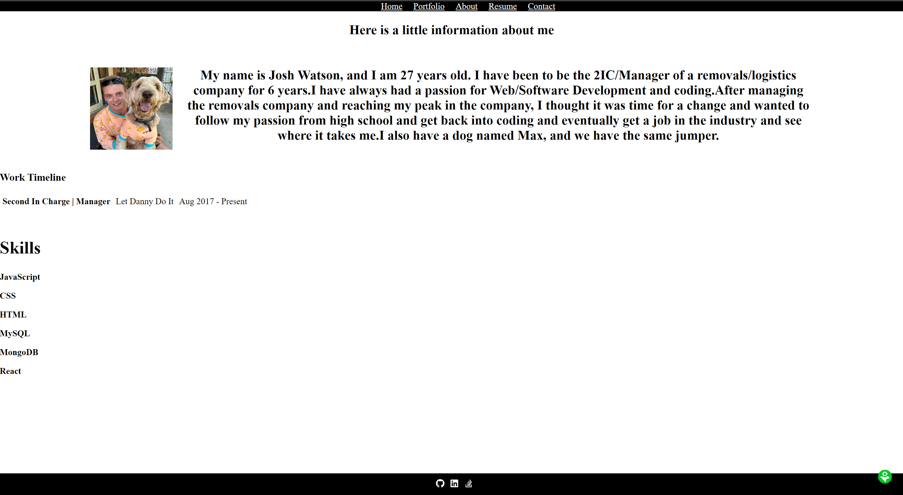

# ReactPortfolio

## Description 
This is my portfolio made with React  
Here is the deployed link to my website!
https://joshua-watson96.github.io/ReactPortfolio

## Screenshots

This is the landing page of the website

This is the Portfolio page of the website

This is the About page of the website

This is the Contact page of the website

## Table of contents
- [Go to Installation](#installation) 
- [Go to Usage](#usage) 
- [Go to Contributing](#contributing) 
- [Go to Tests](#tests)
- [Go to License](#license)
- [Go to Questions](#questions)

## Installation
To install this website to your computer. Clone the repo, type ``npm install`` in the termninal followed by ``npm start``
    
## Usage
The usage of this website is to show off my portfolio using React.

## Contributing
N/A

## Tests
N/A

## License

## Questions

Please checkout my Github account: https://github.com/Joshua-Watson96 

Please e-mail me with any further questions:  joshjkwatson@gmail.com
